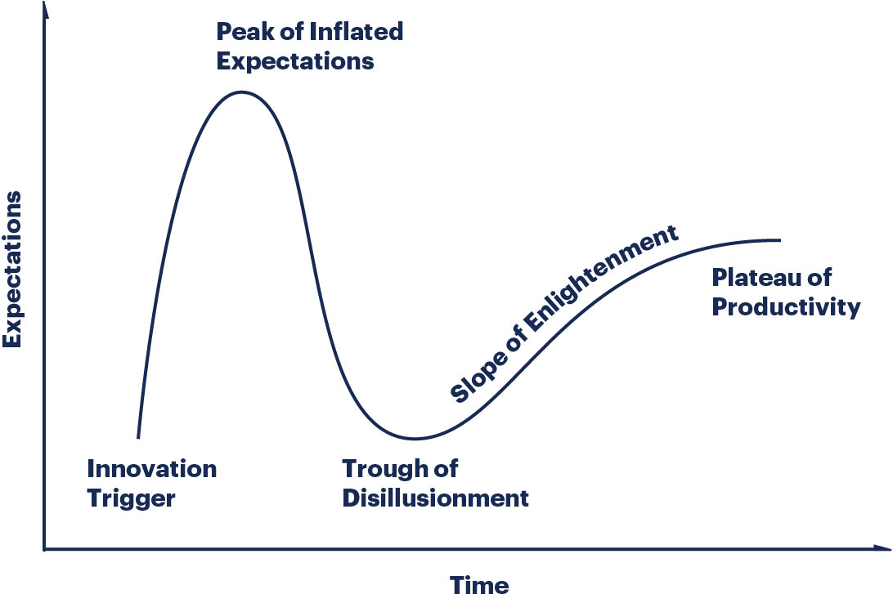

# Filling in the gaps of Multi-cluster Management

Around 2010-ish I was a part of a company going through a series of acquisitions, all of which were unique in some way - it was a melting pot which contained varying levels of maturity, infrastructure, and process. M&A's are always an interesting exercise, but this one was especially unique for the teams I was leading because public clouds were really ramping up in popularity around this time. One of the companies we acquired had good portions of their infrastructure in AWS, which had capabilities that were more advanced than anything we were doing on our own. We ended up deciding to go all-in on AWS, and one of the things that's stuck with me over the years is how many different aspects of the platform at the time we had to "fill-in." Things like some of the aspects of billing or IP planning were things we needed to figure out on our own.

No one piece of technology or vendor is a panacea, and it goes without saying that the capabilities of a platform always intersect with the needs of a business, as well as the humans involved in it. When @jacobsmith approached me about writing a piece around the things we had built with Kubernetes, I had an immediate eye roll - "not another click-bait article" I thought. He wouldn't let it go, and challenged me to think about what would be interesting for "my people" to read about. I know for myself and many of my colleagues, there's active disinterest in reading (or writing) about well-known topics or mature areas of the stack, so I thought about what we may be doing today that either isn't a solved problem in the community or at a minimum isn't commonly written about - enter: multi-cluster management.

Before everyone dusts off their pitchforks or blows up my inbox with links to [kubefed](https://github.com/kubernetes-sigs/kubefed) or similar, let me talk a bit lower-level as to why functionally or technically many of these projects would not work for our specific use cases. Walking in the door day 1 at Equinix Metal, the expectation was set that we'd be aggressively expanding into new data centers, and that I'd be effectively the first tenant as establishing our cluster and deployment tooling was the pre-requisite for Engineering and Ops to do their work (check out Kelsey's blog on [turning the physical digital](https://metal.equinix.com/blog/turning-up-a-cloud/)). I could write an entire piece on the how we PXE and initialize a cluster in a new facility with no existing assets, but for now just trust that no amount of rubbing cluster-api or kubefed on the problem changes that paradigm. On top of running on bare metal, needing to break ground in new facilities, we have to run at least one cluster per-facility we're in and also need a home for more centrally run assets (e.g. our API / data stores). Take a look at Equinix Metal's [locations](https://metal.equinix.com/product/locations/) and planned location and you'll get an immediate sense we're talking at least dozens of clusters day 1, maybe upwards of 100+ over the coming years.

## Approaching the problem

When I think about my personal journey with Kubernetes it reminds me a lot of Gartner's technology hype:

You can't approach scale with optimism. When you're in the business of scaling systems you're accepting the fact that your systems are in a constant state of partial failure. I picture this kind of perpetual state as something akin to a volcano; even while dormant is dangerous, and escalating can cause it to overflow. While you may not want to be overly Astrid Atkinson

The problem with optimism there isn't that you're looking for Waldo too long before you realize Waldo isn't there, it's that when things break, you not only don't know why - you don't know how to fix them.

Systems scale by pushing duties out to the edges

The problem with optimism isn't that you keep looking for Waldo even though Waldo might not be there, it's that when things do go wrong (which they inevitably do) you don't know how to fix it. The problem with scale is that you can’t approach it with optimism. As the system grows, it needs redundancy, or to be able to function in the presence of partial errors or intermittent faults. Humans can only fill in so many gaps.

When I first became entrenched

Reading code requires significantly less creativity. The hard part was done by someone else and you’re just trying to figure out what that hard part was.

It’s the same reason why listening to music or reading a book is much easier than composing a song or writing a great novel. If you want to be better at creation you need to create.

Just because I can read Shakespeare does not mean I am capable of writing it

The problem with optimism is that when things do go wrong, not only do you have no idea how to fix it, you don’t even know what went wrong. To some extent, a message broker hides errors—programs can come and go as they please, and there’s no way to tell if the other part is still reading your messages—but it can only hide errors for so long.

 According to a New York Magazine article on defensive pessimism, while it might seem better to expect things to go well and not worry about negative outcomes, it most certainly is not better. According to research conducted by Dr. Julie Norem, a psychology professor at Wellesley College and a leading researcher of the defensive pessimism concept, defensive pessimists actually benefit from all the worrying they do as they approach situations more fully prepared.

 Google’s biggest DoS attacks come from ourselves—because we have really big systems—although every now and then someone will show up and try to give us a run for our money, but really we’re more capable of hammering ourselves into the ground than anybody else is.

This is true for all systems.

Astrid Atkinson, Engineering for the Long Game
